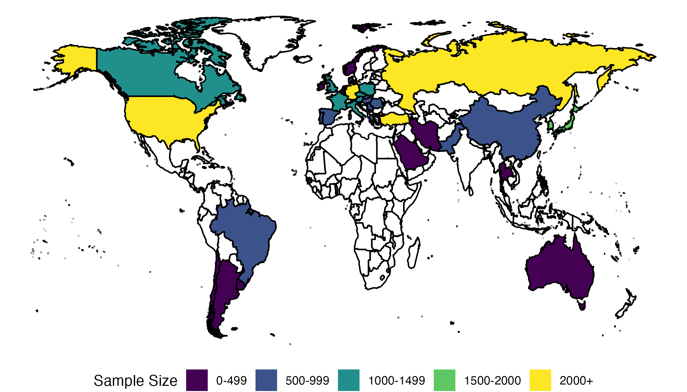

```{r setup, include=FALSE, echo = FALSE, message = FALSE, warning = FALSE}
knitr::opts_chunk$set(echo = FALSE, size="scriptsize")
def.chunk.hook <- knitr::knit_hooks$get("chunk")
knitr::knit_hooks$set(chunk = function(x, options) {
  x <- def.chunk.hook(x, options)
  ifelse(options$size != "normalsize", paste0("\\", options$size,"\n\n", x, "\n\n \\normalsize"), x)
})
```

```{r libraries, include=FALSE, echo = FALSE, message = FALSE, warning = FALSE}
## libraries
library(dplyr)
library(psych)
library(tidyr)
library(ggplot2)
library(rio)
set.seed(58902)
library(nlme)
library(MuMIn)
library(performance)
library(parameters)
library(ggridges)
library(papaja)
library(flextable)
```

```{r import-data}
parts <- list.files("../05_Data/data_processing/output_data/participant_data",
                       pattern = "data.csv",
                       full.names = TRUE,
                       recursive = TRUE)
parts.list <- list()
for (i in 1:length(parts)){
  parts.list[[i]] <- import(parts[i]) %>% 
    mutate(url_lab = as.character(url_lab),
           language = parts[i])
}

parts.data <- bind_rows(parts.list) %>% 
  mutate(language = gsub("../05_Data/data_processing/output_data/participant_data/|_participant_data.csv", "", language)) %>% 
  unique()

lab.data <- import("supplemental/irb_lab_summary.csv")
lang.data <- import("supplemental/language_summary.csv")
```

## Languages 

43 languages were originally identified for possible data collection based on the information available from the OpenSubtitles and subs2vec project. For the following 30 languages/dialects, we translated stimuli and collected data from at least one participant (starred languages were included in our pre-registered minimum data collection plan): 

Arabic, Brazilian Portuguese, Czech\*, Danish, Dutch, English\*, Farsi, French, German\*, Greek, Hebrew, Hindi, Hungarian, Italian, Japanese\*, Korean\*, Norwegian, Polish, Portuguese\*, Romanian, Russian\*, Serbian, Simplified Chinese\*, Slovak, Slovenian, Spanish\*, Swedish, Thai, Traditional Chinese, Turkish\*, and Urdu. Table 1 (below) portrays a summary of each language’s data collection for the number of included participants (based on the pre-registered data inclusion rules), the number of excluded participants, proportion of correct answers for included participants^[Participant accuracy scores were calculated, and then the average of participant accuracy scores for each language were calculated], and the median completion time for included participants. The complete breakdown of gender, education, age, and stimuli completion can be found in the supplemental materials. The following languages met the minimum data collection requirements and will be analyzed in this manuscript: Czech, Danish, German, Greek, English, Spanish, French, Hungarian, Italian, Japanese, Korean, Polish, Portuguese, Brazilian Portuguese, Romanian, Russian, Serbian, Turkish, and Simplified Chinese. The stimuli list for Portuguese and Brazilian Portuguese overlapped by 90%, and data were combined such that each unique target (unrelated and related trials) obtained the minimum number of participant answers^[We present the results combined when discussing trials or global information, but separated when examining item or priming level effects]. All data are available online, even for those languages that did not meet the pre-registered minimum data collection criterion for analysis. For each language, we also provide data checks and a summary of the number of participants, trials, items, and priming trials during data processing (see Supplemental Materials).

```{r table-lang}
# lang table 
flextable(
  lang.data %>% 
  select(Language_Name, Keep, Exclude, M_Correct, Med_Time) %>% 
    filter(Language_Name != "Brazilian Portuguese")
  ) %>% 
  set_header_labels(x = ., 
                    values = c("Language", "N Include", "N Exclude", "Proportion Correct", 
                      "Median Time")) %>% 
  autofit() %>% 
  add_header_lines("Table 1. Language Data Collection Sample Sizes, Accuracy, and Median Response Time")
  
```

## Ethics and Research Labs

We did not collect any identifiable private or personal data as part of the experiment. This project was approved by Harrisburg University of Science and Technology conforming to all relevant ethical guidelines and the Declaration of Helsinki, with special care to conform to the General Data Protection Regulation (GDPR; eugdpr.org). No global exclusion criteria for participating in the study were used, except for a minimum age requirement of 18 years. Please see the analysis section below for other participant and trial level exclusion criteria related to analyses.

```{r lab-data}
geo <- lab.data$country
geo <- strsplit(geo, ",")
geo <- unlist(geo)
geo <- geo[!grepl("^NA|No Requirement", geo)]
geo <- unique(trimws(tolower(geo)))

only_collect_IRB <- lab.data %>% 
  filter(!duplicated(lab.data %>% select(link_IRB))) %>% 
  filter(Keep >= 1) %>% 
  group_by(type_IRB) %>% 
  summarize(count_labs = n())
```

`r length(unique(lab.data$link_IRB))` labs completed ethics documentation for data collection, and `r length(unique(na.omit(lab.data$link_IRB[lab.data$Keep >= 1])))` labs in `r length(geo)` geopolitical regions collected data (i.e., *N* >= 1) for the study. Each data collection lab obtained local ethical review (`r only_collect_IRB %>% filter(type_IRB == "Local IRB") %>% pull(count_labs)`), relied on the ethical review provided by Harrisburg University (`r only_collect_IRB %>% filter(type_IRB == "Rely on HU") %>% pull(count_labs)`), or provided evidence of no required ethical review (`r only_collect_IRB %>% filter(type_IRB == "No Ethics") %>% pull(count_labs)`). The supplemental materials provide links to the IRB approvals on the Open Science Framework (OSF) and a table of participating labs with their data collection information, which includes languages sampled, geopolitical region of the team, compensation procedure and amount, online versus in person testing, and testing type (individual participants or classroom type settings). This information can be matched to study data using the lab code that is present in the participant and trial level files. Figure 1 demonstrates a visualization of the entire sample using the lab’s geopolitical region during data collection. 

```{r include-pic}
# note this picture is made in a different file

```

*Figure 1*. Binned sample sizes based on research lab geopolitical region demonstrating the full data available for reuse from the project. 

## Participants

```{r}
languages <- c("cs", "da", "de", "el", "en", "es", "fr", "hu", 
               "it", "ja", "ko", "pl", "pt_combo", "ro", "ru", 
               "sr", "tr", "zh")

only.parts <- parts.data %>% 
  filter(language %in% languages)
```

`r formatC(nrow(parts.data), big.mark = ",")` participants opened the link to the study, and `r formatC(length(na.omit(parts.data$n_trials)), big.mark = ",")` proceeded through to complete at least one trial of the study trials (i.e., past the practice trials). Of these participants, `r formatC(sum(parts.data$keep == "keep"), big.mark = ",")` were retained for analysis because they met our three participant level inclusion rules: 1) at least 18 years of age, 2) completed at least 100 trials, and 3) scored at least 80% correct. All exclusion criteria are summarized in the results section for clarity. The pre-registered plan calculated accuracy as $\frac{N_{Correct}}{N_{Trials Seen}}$ in the planned scripts; however, an administrative team discussion revealed that the pre-registered report could be interpreted as $\frac{N_{Correct}}{N_{Answered}}$. If accuracy is recalculated using this formula, `r formatC(sum(parts.data$keep_answered == "keep"), big.mark = ",")` participants would be included for analysis. This report will use the stricter criterion of accuracy for analysis, while the analysis using the rescored accuracy can be found in our supplemental materials. The analyses reported below only examine languages that met the minimum data criteria, which includes `r formatC(nrow(only.parts), big.mark = ",")` total participants, `r formatC(length(na.omit(only.parts$n_trials)), big.mark = ",")` who completed at least one trial, `r formatC(sum(only.parts$keep == "keep"), big.mark = ",")` who met the strict inclusion rules, and `r formatC(sum(only.parts$keep_answered == "keep"), big.mark = ",")` that met the rescored version of the inclusion rule for accuracy. Descriptive statistics about participants are provided below in the results for the `r formatC(sum(only.parts$keep == "keep"), big.mark = ",")` participants who met the strict inclusion rules. 

