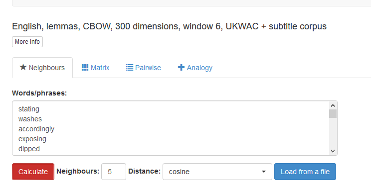

```{r setup, include=FALSE}
knitr::opts_chunk$set(echo = TRUE, size="scriptsize")
def.chunk.hook <- knitr::knit_hooks$get("chunk")
knitr::knit_hooks$set(chunk = function(x, options) {
  x <- def.chunk.hook(x, options)
  ifelse(options$size != "normalsize", paste0("\\", options$size,"\n\n", x, "\n\n \\normalsize"), x)
})
library(readxl)
```

First, words will be selected from the SUBTLEX projects that are:

  1) Not stopwords (the, an, of)
  2) Three or more characters
  3) In the top 10,000 words
  
We are using the `Lg10WF` data - this is the log of the word frequency from the subtitle counts. Using log of frequency is advantageous, we can compare the frequencies across datasets, as well as deal with the large skew present in frequency data.  

```{r import_data, warning = F, message = F, eval = F}
##Library to read excel files
library(readxl)

##library for stopwords
library(stopwords)

library(dplyr)

##Import the US English Data
US_freq <- read_excel("similarity_data/SUBTLEXusfrequencyabove1.xls")
##Import the Dutch Data
load("similarity_data/SUBTLEX-NL.cd-above2.Rdata")
NL_freq <- subtlex.nl.cdgt2
rm(subtlex.nl.cdgt2)

##lower case all words
US_freq$Word <- tolower(US_freq$Word)
NL_freq$Word <- tolower(NL_freq$Word)

##Grab the top 10,000 words 
US_subset <- US_freq %>% #data frame
  filter(!Word %in% stopwords(language = "en")) %>%  #take out stop words 
  filter(nchar(Word) >= 3) %>% #words greater than or equal 3
  arrange(Lg10WF) %>% #sort by Log10WF 
  top_n(10000) #Take the top 10k
  
NL_subset <- NL_freq %>% #data frame
  filter(!Word %in% stopwords(language = "nl")) %>%  #take out stop words 
  filter(nchar(Word) >= 3) %>% #words greater than or equal 3
  arrange(Lg10WF) %>% #sort by Log10WF 
  top_n(10000) #Take the top 10k

##these libraries will be combined with translate R
##this service is not free, uses google's API
##will work with the university to see if we have
##a service already for this type of task 
#library(translateR)

write.csv(US_subset, "US_subset_words.csv", row.names = F)
write.csv(NL_subset, "NL_subset_words.csv", row.names = F)
```

In this next step, I worked with the online interface for snaut using the pre-defined English/Dutch lemma space. Spaces are currently only available for English and Dutch built with the SUBTLEX projects. Their paper for the snaut model details the creation of the space, and the model can be created from the raw SUBTLEX files. If accepted, we will work with the original authors (Pawel Mandera and Marc Brysbaert) to create models for all the target languages. The SUBTLEX data is partially online in raw form (i.e., complete movie subtitles, rather than summary statistics), but the lines of the data are currently scrambled for copyright purposes. We will also use a full word semantic space - this semantic space for example purposes is only lemmas (i.e., root word forms, running --> run). 

If SUBTLEX data cannot be made available, we will use semantic feature production norms or free association norms to create highly similar pairs across languages and translate into languages that do not have feature production or free association norms available. 

```{r pic_snaut}

```

Here's an example of the Dutch data - I am processing the information produced from snaut into a file with the top five cosines for each prime word that is included in the semantic space. Cosine is a similarity value that indicates 0 (no similarity) to 1 (perfect similarity), and can be interpreted in the same fashion as a correlation. 

```{r NL_example}
library(readxl)

##read in the excel file from snaut
NL_snaut <- read_excel("NL_snaut.xlsx", col_names = FALSE)

##give real column names
colnames(NL_snaut) <- c("Prime", "cosine")

##figure out the priming words because the formatting is bad
##imported as small 6 line tables with multiple headers
target_words <- subset(NL_snaut, 
                       cosine == "Distance")

##put the prime word with it's targets 
NL_snaut$Target <- rep(target_words$Prime, each = 7)

##take out all the extra headers and repeated prime words
NL_snaut <- subset(NL_snaut,
                   cosine != "Distance" & cosine > 0)

##print out the final list if you have the right encoding 
head(NL_snaut, n = 15)
```

Here's an example of the US data: 

```{r US_example}
##read in the excel file from snaut
US_snaut <- read_excel("US_snaut.xlsx", col_names = FALSE)

##give real column names
colnames(US_snaut) <- c("Prime", "cosine")

##figure out the priming words because the formatting is bad
##imported as small 6 line tables with multiple headers
target_words <- subset(US_snaut, 
                       cosine == "Distance")

##put the prime word with it's targets 
US_snaut$Target <- rep(target_words$Prime, each = 7)

##take out all the extra headers and repeated prime words
US_snaut <- subset(US_snaut,
                   cosine != "Distance" & cosine > 0)

##print out the final list 
head(US_snaut, n = 15)
##note the NA values here are expected, other columns have values but there's 129 of them, which is silly to print out 
```

The data here would then be merged across languages (not shown because of cost - see above). Native speakers will be recruited to ensure the accurate translation of word pairs. The related word pairs (n = 1000) will be selected from the list using each concept only once, favoring pairs with translations in most languages. If a selected pair does not exist in a language, translation from a Native speaker will be used to create that pair. Words will also be cross referenced for polysemy (i.e., multiple meanings) and these will be restricted when possible. 

Next, these words would be combined together with the original frequency data and the other possible variables available mentioned in the proposal like imageability, age of acquisition, etc. LexOPS contains many of these variables already in English, but the sources for the non-English languages will be pulled from the LAB database (www.wordnorms.com; Buchanan et al., 2019). These will be compiled for inclusion in the R package for the project. 

```{r lexops}
library(LexOPS)
##load the pretty data Jack has made
data("lexops")

##code example of data merging
##in reality, we would separate these databases and merge one at a time
##mostly because they would not be pre-arranged in non-English languages
US_stimuli <- merge(US_snaut, lexops, by.x = "Target", by.y = "string", all.x = T)

##make the columns indicate that's for targets
colnames(US_stimuli)[4:66] <- paste("T_", colnames(US_stimuli)[4:66], sep = "")

##merge again for prime
US_stimuli <- merge(US_stimuli, lexops, by.x = "Target", by.y = "string", all.x = T)

##make columns clear it's for the prime
colnames(US_stimuli)[67:129] <- paste("P_", colnames(US_stimuli)[67:129], sep = "")

head(US_stimuli[ , 1:5])
```

Unrelated pairs are created by rearranging the presentation of related pairs, ensuring that the pairs are not related in the original semantic space. This process will be a random assignment of primes to targets, and then cross checked in their respective semantic spaces. Note that unrelated pairs are only randomized once - so that each unrelated combination only occurs once (i.e., TREE-NURSE is the unrelated pair for the NURST target; while DOCTOR-NURSE is the related pair for the NURSE target). The Wuggy program will be used to create nonwords from the final list (Keuleers & Brysbaert, 2010).
