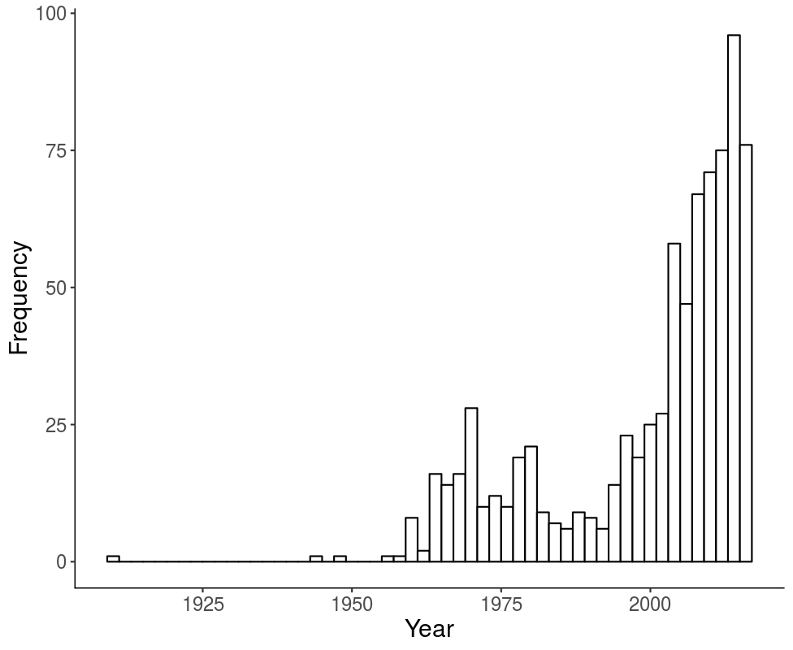

```{r setup, include=FALSE}
knitr::opts_chunk$set(echo = FALSE)
library(dplyr)
library(psych)
library(ggplot2)
library(reshape)
```

## Replication and Reproducibility

:::: {.columns}
::: {.column width="50%"}
- Long standing traditional to use controlled stimuli in the cognitive sciences
- Recent focus on replication and reproducibility has increased this focus
- Recent increase in publication of linguistic norms has lead to the availability of these norms for many variables
:::
::: {.column width="50%"}
```{r echo=FALSE, out.width="80%"}

```
:::
::::

## Powering Your Research

- Decisions on sample size planning usually driven by:
  
  - Research design
  - Choice of hypothesis test
  - Effect size estimation

- What can you do when you do not have these? 

## Moving Beyond N = 30 

- Issues of power and sample size have been largely ignored for norming data collection
- Sample size planning for qualitative data collection? 
- Power can be difficult for complex cognitive designs with many items

## Coverage, Saturation: Qualitative Studies 

- Semantic property listing task 

  - What are the features of a *zebra*?
  - \<has stripes\>, \<is a horse\>, \<is mean\>

- Canessa, Chaigneau, Lagos & Medina (2020)
  
  - Define a minimum coverage criteria
  - Conduct the property listing task with set sample size
  - Estimate current coverage 
  - Estimate the extra sample size for desired coverage 
  - Repeat until coverage is met 

## AIPE: Quantitative Studies 

- AIPE: Accuracy in Parameter Estimation
- Focus shifts from *p*-values to confidence intervals that are "sufficiently narrow"
- Multistep procedure:
  
  - Define a minimum acceptable sample size
  - Define a stopping rule
  - Define a maximum sample size

- Kelley, 2007; Kelley, Darku, & Chattopadhyay, 2018; Maxwell, Kelley, & Rausch, 2008

## Example: Response Latencies 

- The English Lexicon Project: lexical decision and naming response latencies for over 40,000 words
- Data provides a good metric for base response latencies for words 
- Control for participant variability in base response latency by first standardizing participant responses within data collection sessions (Faust, Balota, Spieler, Ferraro, 1999)

```{r read_data, echo = F}
#read in the ELP data
ELPmaster <- read.csv("../04_Power/ELPDecisionData.csv")

#use the ave function to create a z-score of each participant
#they only did one session 
ELPmaster$ZScore <- ave(ELPmaster$RT, #dependent variable
                        ELPmaster$Participant, #group variable
                        FUN = scale) #function, scale is z-scoring

#exclude 0 accuracy for incorrect
#exclude 0 type, which is non-words
#subset is like filter in tidyverse
ELPcorrect <- subset(ELPmaster, #data frame
                     Accuracy > 0 & Type > 0) #logical rules to subset by

#view the data 
head(ELPcorrect)
```

## Example: Response Latencies

- Define a stopping rule
  
  - What should a sufficiently narrow confidence interval be? 
  - Accurately estimate which parameter? (effect size, response latency)

## Example: Response Latencies

- What is the average standard error for our standardized response latencies?

```{r summary_stats, warning = F, message = F, echo = F}
##summarize the dataframe to see what the average SE is
summary_stats <- ELPcorrect %>% #data frame
  select(ZScore, Stimulus) %>% #pick the columns
  group_by(Stimulus) %>% #put together the stimuli
  summarize(SES = sd(ZScore)/sqrt(length(ZScore)), samplesize = length(ZScore)) #create SE and the sample size for below 

##give descriptives of the SEs
descriptives <- describe(summary_stats$SES)

ggplot(summary_stats, aes(SES)) +
  geom_histogram(binwidth = .01) +
  theme_classic() +
  xlab("Standard Error") +
  ylab("Frequency") + 
  annotate("text", x = 2, y = 2500, 
           label = paste("Mean =", format(descriptives$mean, digits = 2))) +
  annotate("text", x = 2, y = 2300, 
           label = paste("SD =", format(round(descriptives$sd, digits = 2), nsmall = 2))) +
  annotate("text", x = 2, y = 2100, 
           label = paste("Median =", format(descriptives$median, digits = 2)))
```

## Example: Response Latencies

- If I assume these data to be representative, what actual sample size might approximate SE = 0.16?
- Simulation of 100 randomly sampled words with sample sizes ranging from 5 to 200. 

```{r sim_elp, warning = F, messages = F, echo = F}
# ##pick 100 random words with sample sizes above 30
# targets <- summary_stats %>% #data frame
#   filter(samplesize >=30) %>%  #filter out sample sizes
#   select(Stimulus) %>% #select only stimuli
#   sample_n(100) %>% #get 100
#   pull(Stimulus) #return a vector
# targets <- as.character(targets)
# 
# ##this section creates a sequence of sample sizes to estimate at
# #5, 10, 15, etc. 
# samplesize_values <- seq(5, 200, 5) 
# #create a blank table for us to save the values in 
# sim_table <- matrix(NA, nrow = length(samplesize_values), ncol = length(targets))
# #create column names based on the current targets
# colnames(sim_table) <- targets
# #make it a data frame
# sim_table <- as.data.frame(sim_table)
# #add those sample size values 
# sim_table$sample_size <- samplesize_values
# 
# ##loop over all the target words randomly selected
# for (i in 1:length(targets)){
#   
#   ##loop over sample sizes
#   for (q in 1:length(samplesize_values)){
#     
#     ##temporarily save a data frame of Zscores 
#     temp <- ELPcorrect %>% #data frame
#       filter(Stimulus == targets[i])  %>% #pick rows that are the current target word
#       sample_n(samplesize_values[q], replace = T) %>% #select sample size number of rows 
#       pull(ZScore)
#     
#     #put that in the table
#     #find the sample size row and column we are working with
#     #calculate SE sd/sqrt(n)
#     sim_table[sim_table$sample_size == samplesize_values[q], targets[i]] <- sd(temp)/sqrt(length(temp))
#   
#     }
#   
# }
# 
# write.csv(sim_table, file = "sim_table.csv", row.names = F)

sim_table <- read.csv("sim_table.csv")

##melt down the data into long format for ggplot2
sim_table_long <- melt(sim_table, 
                      id = "sample_size")

##create a graph of the sample size by SE value
ggplot(sim_table_long, aes(sample_size, value)) + 
  theme_classic() +
  xlab("Sample Size") +
  ylab("Standard Error") + 
  geom_point() + 
  geom_hline(yintercept = .16) #mark here .16 occurs
```

## Example: Response Latencies

- What sample sizes should we use?

  - 80% below SE: *N* = 25
  - 90% below SE: *N* = 35
  - 95% below SE: *N* = 50

- Define a minimum acceptable sample size: *N* = 35
- Define a maximum acceptable sample size ($, time, effort): *N* = 300
  
```{r power, echo = F}
# ##calculate the percent below .16
# sim_table_long %>% #data frame
#   group_by(sample_size) %>% #group by sample size
#   summarize(Percent_Below = sum(value<=.16)) %>%  #is it less than .16
#   print(n = nrow(.))
```

## How to Run the Study

- Pre-register your plans! 
- Collect data for minimum sample size
- Estimate the confidence interval for the items presented
- If confidence interval meets criteria, stop data collection
- If confidence interval does not meet criteria, continue collection
- Continue to repeat until criteria or maximum sample size reached

## Other Considerations

- Consider an adaptive design wherein participants see a subset of stimuli

  - Sample stimuli based on their potential variability 
  - After minimum sample size, estimate confidence interval, and decrease the probability of being shown for items that have reached or are "close" to criteria
  
- Consider using multilevel models for studies with hypothesis tests (Brysbaert & Stevens, 2018)

## PSA 007 SPAM-L

:::: {.columns}
::: {.column width="70%"}
- Outcomes: 
  
  - Create an online framework for data collection, modeling after the success of the Small World of Words (De Deyne, Navarro, Perfors, Brysbaert, & Storms, 2019)
  - Produce a large, multi-linguistic semantic priming dataset complete with other cognitive variables 
  - Provide computational packages for researchers to explore and use the datasets, modeled after *LexOPS* (Taylor, Beith, & Sereno, 2020)

- Learn more: https://psysciacc.org/psacon2020-videos/ 
- Join us! Email buchananlab\@gmail.com 
:::
::: {.column width="30%"}
```{r echo=FALSE, out.width="80%"}

```
:::
::::

## Questions

- Thank you for listening!
- Interested in the code? Check out https://github.com/SemanticPriming/SPAML