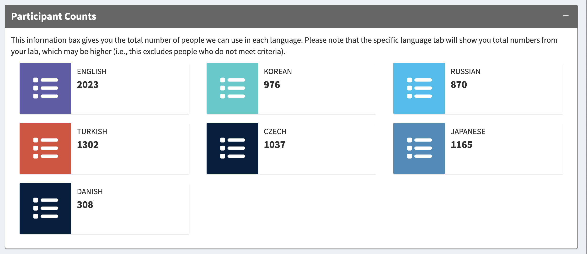

```{r setup, include=FALSE}
knitr::opts_chunk$set(echo = FALSE)
library(rio)
library(dplyr)
library(ggplot2)
```

```{r data}
cs_prime <- read.csv("../../05_Data_real/output_data/cs_prime_data.csv")
en_prime <- read.csv("../../05_Data_real/output_data/en_prime_data.csv")
ja_prime <- read.csv("../../05_Data_real/output_data/ja_prime_data.csv")
ko_prime <- read.csv("../../05_Data_real/output_data/ko_prime_data.csv")
ru_prime <- read.csv("../../05_Data_real/output_data/ru_prime_data.csv")
tr_prime <- read.csv("../../05_Data_real/output_data/tr_prime_data.csv")

overall <- bind_rows(
  cs_prime %>% mutate(lang = "Czech"),
  en_prime %>% mutate(lang = "English"),
  ja_prime %>% mutate(lang = "Japanese"),
  ko_prime %>% mutate(lang = "Korean"),
  ru_prime %>% mutate(lang = "Russian"),
  tr_prime %>% mutate(lang = "Turkish")
)
```

## The Psychological Science Accelerator 

:::: {.columns}
::: {.column width="70%"}
- The PSA is a CERN for psychological science
- Globally distributed network of researchers with more than 1000 members in 82 countries 
- Open science principles and practices 
- PSA007: Semantic Priming Across Many Languages 
:::
::: {.column width="30%"}
```{r echo=FALSE, out.width="80%"}

```
:::
::::

## Semantic Priming 

- Semantic priming has a rich history in cognitive psychology
- Semantic priming occurs when response latencies are facilitated (faster) for related word-pairs than unrelated word-pairs
- Usually measured with the lexical decision or naming task 
- The Semantic Priming Project (Hutchison et al., 2013) provided priming values for 1661 English word-pairs

## Semantic Priming

- **Semantic** priming replicates pretty well
- WEIRD words 
- Single language focus or multilingual individuals 
- A lack of data sets that are matched on language within one study 
- How can we leverage the computational skills found in natural language processing with the open data publications to improve this research? 
- Goals of of the SPAML:
  - Assess semantic priming across (at least) 10 languages using matched stimuli
  - Provide a large-scale data set for reuse in linguistics 
- Registered Report at *Nature Human Behaviour*

## The Stimuli

- Corpus Text Data: [Open Subtitles Project](http://opus.nlpl.eu/OpenSubtitles-v2018.php)
- Subtitles have shown to be critically useful data sets for word frequency calculation (New et al., 2007; Brysbaert & New, 2009; Keuleers et al., 2010; Cuetos et al., 2012; Van Heuven et al., 2014; Mandera et al., 2015; and more)
- Freely available subtitles in 63 languages for computational analysis
- Approximately 43 languages contain enough data to be usable for these projects

## The Stimuli

- For each language:
  - Collect the top 10,000 most frequent nouns, verbs, adjectives, and adverbs
  - Find the top five most similar words using cosine from subs2vec (van Paridon & Thompson, 2021)
  - Cross-reference this list across languages 
  - Pick the most overlapping stimuli limiting repeats and proper names
  - 1000 final pairs
- Important: driven by the language, not English translation
  
## Nonwords and Translators

- Nonwords are generated with a Wuggy-like algorithm (Keuleers & Brysbaert, 2010)
- Translators check all pairs for proper translation, form, and meaning
- They suggest the appropriate words for retaining meaning between cue-target
- They fix nonwords to ensure they are pronounceable, not too fake
- Dialects are considered and separated when appropriate 

## Procedure 

- View a simple version: https://psa007.psysciacc.org/
- Overall task: 
  - A single stream lexical decision task 
  - All words cue-target are judged, cue-target linked by order 
- Trials are formatted as:
  - A fixation cross (+) for 500 ms
  - CUE or TARGET in Serif font
  - Lexical decision response (word, nonsense word)
  - Keyboards are WILD
  - 400 pairs = 800 trials

## Power and Study Design 

- Power focused on using accuracy in parameter estimation to adequately measure each individual item (see anything by Ken Kelley)
- We simulated using the English Lexicon Project and Semantic Priming Project
  - Minimum: *n* = 50 per target word by condition (related, unrelated)
  - Stopping: *SE* = .09
  - Maximum = *n* = 320 
- Adaptive sampling checks and samples pairs once an hour to randomize the study 

## Data Provided

- The data will be provided in several forms: 
  - Subject/trial level: for every participant 
  - Item level: for each individual item, rather than just cue or just concept
  - Priming level: for each related pair compared to the unrelated pair

## Current Data Collection

```{r shiny, out.width="80%"}

```

*Big thanks to [ZPID](https://leibniz-psychology.org/en/) and Harrisburg U

## Overall Priming Distribution Results

<center>

```{r graph1, out.height="100%", out.width="60%"}
prime_dist <- overall %>%
  select(avgZ_prime, lang) %>%
  ggplot(aes(x = lang, y = avgZ_prime, fill = lang)) +
    geom_violin() +
    geom_hline(yintercept = 0) +
    stat_summary(fun = "mean",
                 geom = "crossbar",
                 width = 0.5) +
    xlab("Language") +
    ylab("Priming Z-Score") +
    theme_classic() + 
    theme(legend.position = "none") + 
  theme(text = element_text(size = 15))

prime_dist
```

</center>

## Overall Priming Comparison 

<center>

```{r graph2, out.height="100%", out.width="60%", message=FALSE, warning=FALSE}
ggplot(overall, aes(lang, avgZ_prime, color = lang)) + 
  theme_classic() + 
  xlab("Language") + 
  ylab("Average Z-Priming") + 
  stat_summary(fun = mean, 
               geom = "point") + 
  stat_summary(fun.data = mean_cl_normal, ##adds the error bars
               geom = "errorbar", 
               width = .2) + 
  theme(legend.position = "none") + 
  theme(text = element_text(size = 15)) + 
  coord_cartesian(ylim = c(.07, .17)) + 
  coord_flip()
```

</center>

## Individual Item Priming Results 

<center> 

```{r graph3, out.height="100%", out.width="60%"}
overall_plot <- overall %>% 
  group_by(lang) %>% 
  arrange(avgZ_prime) %>% 
  mutate(count = 1:1000)

ggplot(overall_plot, aes(count, avgZ_prime, color = lang)) + 
  geom_point() +
  theme_classic() + 
  ylab("Average Z-Priming Score") + 
  xlab("Pair Estimate") + 
  geom_hline(yintercept = 0) + 
  scale_color_discrete(name = "Language") +
  theme(text = element_text(size = 15))
```

</center> 

## Final Thoughts 

- This work to diversify participants, languages, and researchers represented is aided by big team science approaches
- Priming effects are found across different writing systems 
- Variability between languages appears to be approximately .02
- More languages currently underway 

## Recruitment and any Questions?

:::: {.columns}
::: {.column width="70%"}
- Thank you for listening!
- We want you - join our team for data collection by contacting me
  - All levels of researchers welcome
  - Authorship is provided for those who meet the collaboration agreement 
- All PSA collaborators are listed with their author information online
:::
::: {.column width="30%"}
```{r echo=FALSE, out.width="80%"}

```
:::
::::


