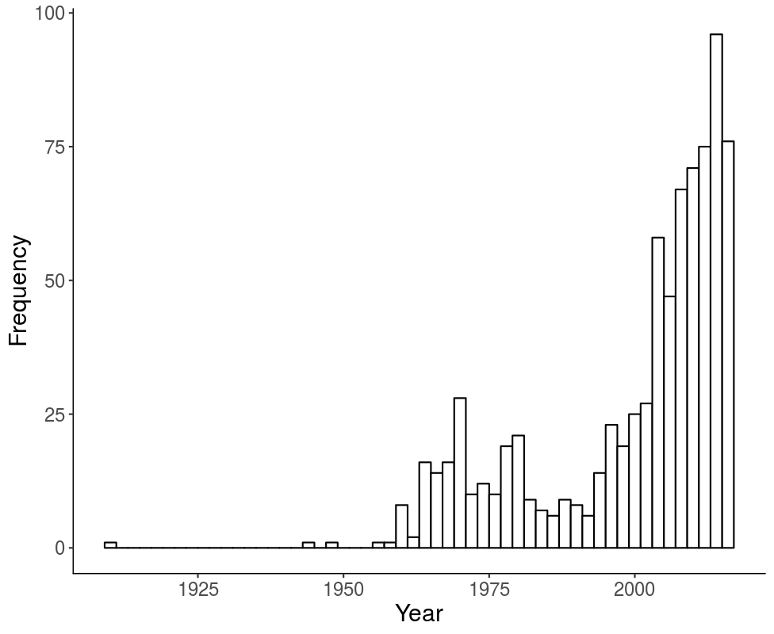

```{r setup, include=FALSE}
knitr::opts_chunk$set(echo = FALSE)
library(rio)
library(ggplot2)
```

## Presentation Outline

- Quick overview of the project
- Specific description of stimuli selection 
- Project progress
- Questions 

## Semantic Priming 

- Semantic priming has a rich history in cognitive psychology
- Semantic priming occurs when response latencies are facilitated (faster) for related word-pairs than unrelated word-pairs
- Usually measured with the lexical decision or naming task 
- The Semantic Priming Project (Hutchison et al., 2013) provided priming values for 1661 English word-pairs
- https://psa007.psysciacc.org/

## Previous Datasets

:::: {.columns}
::: {.column width="50%"}
- What about other datasets?
- What about other languages? 
- Recent increase in publication of linguistic norms has lead to the availability of these norms for many variables
- Multi-linguistic overlap is poor
:::
::: {.column width="50%"}
```{r echo=FALSE, out.width="80%"}

```
:::
::::

## SPAML Goals

- Outcomes: 
  
  - Create an online framework for data collection, modeling after the success of the Small World of Words (De Deyne et al., 2019)
  - Produce a large, multi-linguistic semantic priming dataset complete with other cognitive variables 
  - Provide computational packages for researchers to explore and use the datasets, modeled after *LexOPS* (Taylor et al., 2020)

- Join us! Email 007spaml\@gmail.com

## The Stimuli

- How do you create stimuli for a priming study? 
- Similarity: shared meaning between concepts
  - Defined by face value DOG-CAT versus DOG-SPOON
  - Number of shared features using feature production norms
  - Association strength using free association norms
  - *Co-occurrence using computational models and text corpora*

## Text Corpora

- Where do you get large, open text corpora that are comparable for calculating similarity?
- The Open Subtitles Corpus (http://opus.nlpl.eu/OpenSubtitles-v2018.php) provides linguistic data for 50+ languages 
- Subtitles have shown to be critically useful datasets for word frequency calculation (New et al., 2007; Brysbaert & New, 2009; Keuleers et al., 2010; Cuetos et al., 2012; Van Heuven et al., 2014; Mandera et al., 2015; and more)
- The corpora are freely available to download for use in linguistic projects

## Selection Procedure 

- First, we decided to select nouns, verbs, adjectives, and adverbs for potential inclusion in the study
- Therefore, we needed to be able to use part of speech tagging on our potential languages 
- `udpipe` is a language package in *R* that provides part of speech tagging in many languages 

```{r}
library(udpipe)
udpipe("This package is great!", object = "english")[ , c("token", "upos")]
```

## Selection Procedure 

- Each language corpus with an available `udpipe` model was examined for corpus size and the Wikipedia corpus for that language was added to small corpus languages (Afrikaans, Hindi, Armenian, Tamil, Urdu)
- All stop words and numbers were removed
- All words with less than three characters were removed
- The words were filtered for nouns, verbs, adjectives, and adverbs
- Using word frequency, the top 10,000 words in each language were selected 
- Forty-four languages in total are included!

## Similarity Calculation

- Similarity was calculated by using a FastText model based on the language subtitles and/or Wikipedia combination 
  - The subs2vec project was used for initial calculations (van Paridon & Thompson, 2021)
  - Vector space model of 300 dimensions with 5 count window size 
  - Other ongoing word is comparing different dimensions and window sizes for models
- Cosine is a distance measure of vector similarity, similar to correlation
- Top five cosine values for each word were calculated from the FastText model 

## Cross Referencing

- We then used translation to convert each language's stimuli back to English
- These data were merged together to create a dataset of possible stimuli across all languages 
- 1208416 number of pairs were found across the forty-four languages with an average overlap of 3.23% (2.70 to 70.27)
- The pairs were sorted by language overlap to final selection

## Cross Referencing

- 1000 pairs were selected:
  - Each word was only used once
  - Words were not different forms of the same word (RUNNING - RUN)
  - Limit use of proper names
  
## Cross Referencing 

- The overlap between languages is still difficult: 
  - Mean overlap: 28%
  - Average words for translation: 710

```{r}
words <- import("~/GitHub/SPAML/SPAML-PSA/03_Materials/final_selected_words.csv")
ggplot(words, aes(total)) + 
  geom_histogram(fill = "white", color = "black", binwidth = 2) + 
  theme_classic() + 
  xlab("Total Overlap of Stimuli")
```

## Thoughts on Selection

- Multi-linguistic research is often in a few selected languages
- Even with advances in published datasets, cross referencing is difficult
- However, by focusing on the available data, we can be guided by the language, rather than selecting English words and simply translating 

## Project Update

- If you'd like to join, you can fill out this form: https://member.psysciacc.org/register_canvas.php
- Using Canvas to keep everyone up to date
- How do you track what you've done and need to do? 

## SPAM-L Update

- The network just got its first shot at the registered report!
  - There are nearly 800 comments - whew!
  - The admin team is working on addressing those comments. 
  - We will put together the final draft for you to check your information and provide small comments. 
  - Missed out? Make sure you are getting Canvas notifications so you can join on the second pass of the paper.

## SPAM-L Update

- We are going to apply for the ZPID call for projects.
  - Thankfully, we've written the registered report.
  - Their timeline works with our goals.
  - This support would allow us to cover more languages!

## SPAM-L Update

- We have almost 150 people on the project (and an email box I've been ignoring)
- About 60 filled out the information for the registered report 
- Languages covered: English, Arabic, Dutch, German, Greek, Italian, Polish, Portuguese, Romanian, Russian, Serbian, Spanish 
- We hope to have you involved! 

## SPAM-L Update

- Timeline:
  - Revise the registered report (now, couple weeks)
  - Send to network for final thoughts 
  - ZPID application would be submitted first week of December if we pass the first round
  - Submit the registered report to Nature Human Behavior at the same time 
- What's next?
  - Translation of final instructions and words 
  - Programming of the final procedure
  - Labs can work on their IRBs
  - Then magic! :) 

## Pre-Project Updates

- words2many: 
  - Reviewing datasets and preparing for the second round of invitation for help from PSA 
  - This paper is a Ph.D. project
- subs2strudel: 
  - Still options for spell checking! 
  - This paper is up next for writing after the registered report is submitted
- Power2stimuli: 
  - About to send invitations for how others can contribute 
  - Also up next for writing after the registered report is submitted

## Questions

- Thank you for listening!
- Interested in the code? Check out https://github.com/SemanticPriming/