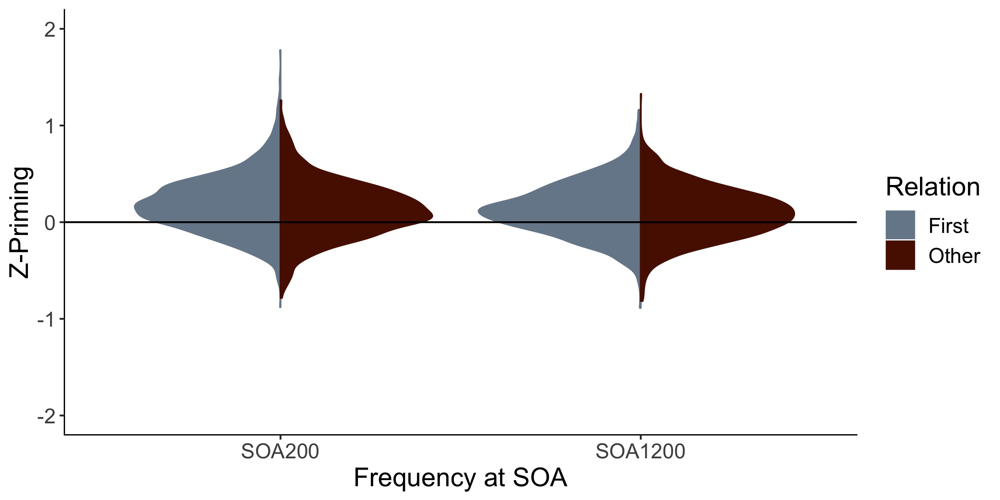
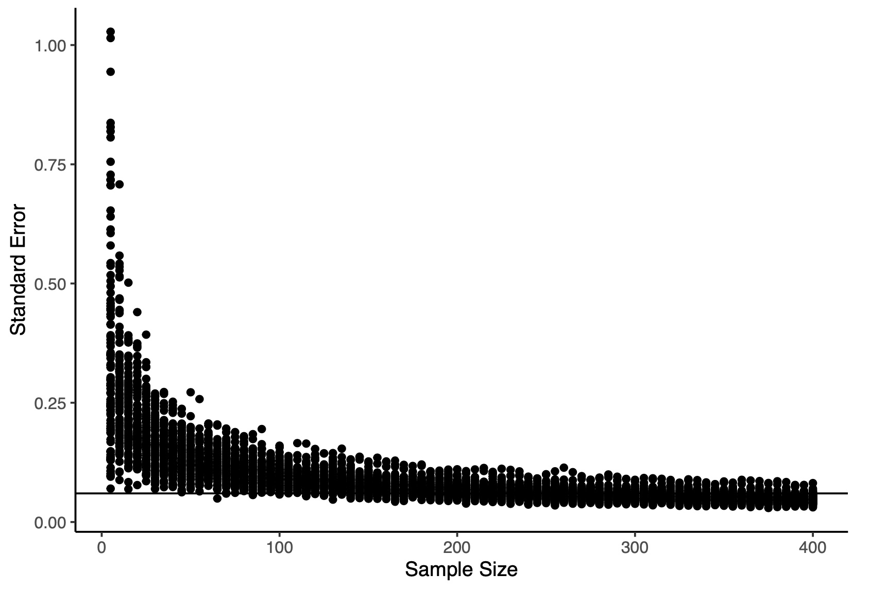
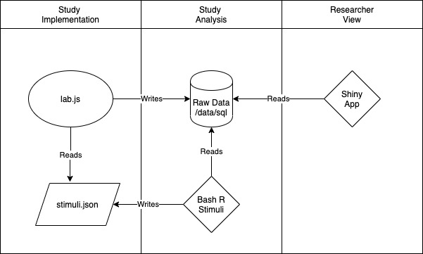

```{r setup, include=FALSE}
knitr::opts_chunk$set(echo = FALSE)
library(rio)
library(ggplot2)
library(dplyr)
library(psych)
library(reshape)
```

## The Psychological Science Accelerator 

:::: {.columns}
::: {.column width="70%"}
- The PSA is a CERN for psychological science
- Globally distributed network of researchers with more than 1000 members in 82 countries 
- Open science principles and practices 
- PSA007: Semantic Priming Across Many Languages 
:::
::: {.column width="30%"}
```{r echo=FALSE, out.width="80%"}
knitr::include_graphics("cropped-cropped-psa.png")
```
:::
::::

## SPAML

- Semantic priming has a rich history in cognitive psychology
- Semantic priming occurs when response latencies are facilitated (faster) for related word-pairs than unrelated word-pairs
- Usually measured with the lexical decision or naming task 
- The Semantic Priming Project (Hutchison et al., 2013) provided priming values for 1661 English word-pairs

## SPAML

- Items are considerably variable ... and current sample sizes may not tell us true population scores  
- This data is only in English

```{r echo=FALSE, out.width="80%"}

```

## SPAML

- Outcomes: 
  
  - Create an online framework for data collection, modeling after the success of the Small World of Words (De Deyne et al., 2019)
  - Produce a large, multi-linguistic semantic priming dataset complete with other cognitive variables 
  - Provide computational packages for researchers to explore and use the datasets, modeled after *LexOPS* (Taylor et al., 2020)

- Learn more: https://psysciacc.org/psacon2020-videos/ 
- Join us! Email 007spaml\@gmail.com

## Adaptive Algorithms for Sampling

- We want to create a large dataset
- But participant attention is a finite resource
- So, we can create a large set of stimuli and sample 
- But should all stimuli have the same sample size?

## Accuracy in Parameter Estimation

- AIPE: Accuracy in Parameter Estimation
- Sample data until confidence intervals that are "sufficiently narrow"
- Multistep procedure:
  
  - Define a minimum acceptable sample size
  - Define a stopping rule
  - Define a maximum sample size

- Kelley, 2007; Kelley et al., 2018; Maxwell et al., 2008

## Defining "Sufficiently Narrow" 

- The English Lexicon Project: lexical decision and naming response latencies for over 40,000 words
- Data provides a good metric for base response latencies for words 

```{r read_data, echo = F}
#read in the ELP data
ELPmaster <- import("~/GitHub/SPAML/SPAML-PSA/02_Power/ELPDecisionData.zip")

#use the ave function to create a z-score of each participant
#they only did one session 
ELPmaster$ZScore <- ave(ELPmaster$RT, #dependent variable
                        ELPmaster$Participant, #group variable
                        FUN = scale) #function, scale is z-scoring

#exclude 0 accuracy for incorrect
#exclude 0 type, which is non-words
#subset is like filter in tidyverse
ELPcorrect <- subset(ELPmaster, #data frame
                     Accuracy > 0 & Type > 0) #logical rules to subset by

#view the data 
head(ELPcorrect)
```

## Defining the Stopping Rule

- Define a stopping rule
- If we want to know when our stimuli is measured "accurately", we might expect our confidence interval to be small.
- By examining previous response latency data, we can determine what that might look like
- What is the average standard error for our standardized response latencies?

## Defining the Stopping Rule

```{r summary_stats, warning = F, message = F, echo = F}
##summarize the dataframe to see what the average SE is
summary_stats <- ELPcorrect %>% #data frame
  select(ZScore, Stimulus) %>% #pick the columns
  group_by(Stimulus) %>% #put together the stimuli
  summarize(SES = sd(ZScore)/sqrt(length(ZScore)), samplesize = length(ZScore)) #create SE and the sample size for below 

##give descriptives of the SEs
descriptives <- describe(summary_stats$SES)

ggplot(summary_stats, aes(SES)) +
  geom_histogram(binwidth = .01) +
  theme_classic() +
  xlab("Standard Error") +
  ylab("Frequency") + 
  annotate("text", x = 2, y = 2500, 
           label = paste("Mean =", format(descriptives$mean, digits = 2))) +
  annotate("text", x = 2, y = 2300, 
           label = paste("SD =", format(round(descriptives$sd, digits = 2), nsmall = 2))) +
  annotate("text", x = 2, y = 2100, 
           label = paste("Median =", format(descriptives$median, digits = 2)))
```

## Defining the Minimum Sample Size 

- If I assume these data to be representative, what actual sample size might approximate SE = 0.16?
- Simulation of 100 randomly sampled words with sample sizes ranging from 5 to 200. 
- Approximately 80% of samples hit the criteria at sample sizes of 25

```{r sim_elp, warning = F, messages = F, echo = F}
sim_table <- read.csv("~/GitHub/SPAML/SPAML-PSA/10_Presentations/pnom_20/sim_table.csv")

##melt down the data into long format for ggplot2
sim_table_long <- melt(sim_table, 
                      id = "sample_size")

##create a graph of the sample size by SE value
ggplot(sim_table_long, aes(sample_size, value)) + 
  theme_classic() +
  xlab("Sample Size") +
  ylab("Standard Error") + 
  geom_point() + 
  geom_hline(yintercept = .16) #mark here .16 occurs
```

## Defining the Maximum Sample Size 

- You could simply define the maximum sample size by time, money, or effort
- You could use a larger power criteria: 90% at *n* = 35, and 95% at *n* =  50 
- In our study, we used the Semantic Priming Project data to define a maximum sample size based on priming scores (*n* = 320)

```{r echo=FALSE, out.width="80%"}

```

## Stimulus Sampling 

- Now, we can apply these rules to our study
- We have selected 1000 stimuli, only show each participant a smaller portion of stimuli 
- At the start of the study, all stimuli have equal probability of being selected
- After each participant, sample size for each stimulus is calculated
- Once the stimulus has achieved the minimum sample size, calculate standard error
- Continue sampling until the item either achieves the goal standard error or maximum sample size 
- Set the probability of selection for that stimulus to floor 
- Continue sampling until complete with all stimuli

## Study Flow 

```{r echo=FALSE, out.width="60%"}

```

## Conclusions

- Previous data and other large norming studies provide quality estimates for this procedure 
- We can collect data on multiple stimuli by optimizing our sample sizes
- By focusing on accuracy in parameter estimation, we provide quality data:
  - That adequately answers hypothesis questions
  - That can be reused 
  - That maximizes experimenter/participant time and effort 

## Questions

- Thank you for listening!
- Interested in the code? Check out https://github.com/SemanticPriming/SPAML
- All PSA collaborators are listed with their author information online